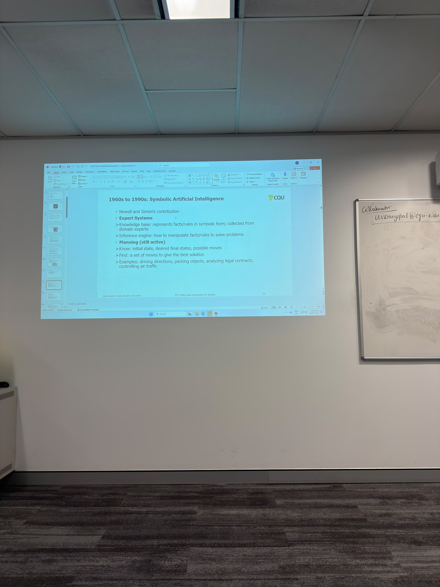

# E-portfolio 1: Artificial Intelligence

Student: S M Shahriar Alam  
Student number: 12301733  
Workshop date: 23 July 2026  
Tutor: Venu Gopal  
Submission due: 26 July 2026  
GitHub repository: <https://github.com/shahriarRaj/COIT11223-Assessment-2-ePortfolios>

This portfolio presents four artefacts that developed my understanding of AI, bias, accountability and the need for human oversight.

## Artefact 1: Australia's National AI Plan

Type: Australian government publication  
Artefact: [National AI Plan](https://www.industry.gov.au/publications/national-ai-plan)

### Summary

Australia's National AI Plan explains how the government intends to develop an AI-enabled economy while managing risk. Its goals are to capture economic opportunities, spread the benefits through workplaces and public services, and keep Australians safe through regulation and responsible AI practices (Department of Industry, Science and Resources 2025).

### Why I selected it and what I learned

I selected this plan because it connects with our workshop discussion about AI governance. Before the class, I thought responsible AI mainly meant checking whether a system worked. I now understand that privacy, fairness and accountability also need attention. Principles are useful, but responsibility must be clear when an AI system causes harm.

## Artefact 2: Bias in AI-supported healthcare

Type: Peer-reviewed journal article  
Artefact: [AI-driven healthcare: A review on ensuring fairness and mitigating bias](https://journals.plos.org/digitalhealth/article?id=10.1371/journal.pdig.0000864)

### Summary

Chinta et al. explain how bias can enter healthcare AI through data selection, measurement, representation, model design and evaluation. For example, dermatology software trained mainly on lighter skin may perform less accurately on darker skin. Representative data and careful testing are therefore necessary for fair healthcare outcomes (Chinta et al. 2025, p. 6).

### Why I selected it and what I learned

I chose this article because healthcare errors can directly affect a person's wellbeing. It showed me that good overall accuracy may hide poor results for an underrepresented group. Healthcare AI should support qualified professionals rather than replace their judgement. Its operation should also be transparent, with people accountable for harmful outcomes (Chinta et al. 2025, p. 9).

## Artefact 3: AI in Australian government decisions

Type: Online news article  
Artefact: [Federal government to tighten rules around use of AI in departmental decision-making](https://www.abc.net.au/news/2026-07-19/government-tighten-rules-ai-artificial-intelligence/106933212)

### Summary

Tregenza reports that Australian government agencies will face tighter oversight when using AI in departmental decisions. The proposed approach calls for fair and accurate decisions, stronger privacy protection and continued human involvement. The report refers to automated processes affecting income support, aged care and disability services (Tregenza 2026).

### Why I selected it and what I learned

I selected this article because a government decision can determine whether someone receives an essential service or payment. A mistake could have serious consequences. People should know when AI contributed to a decision, receive an understandable explanation and have a practical way to challenge an unfair result. Human review must remain available.

## Artefact 4: My Week 2 workshop experience

Type: Personal workshop evidence

*Figure 1: The Week 2 in-person workshop on artificial intelligence. Source: Author's own photograph, 23 July 2026.*

### Workshop activity

During the workshop, I learned about symbolic AI, expert systems, knowledge bases, inference engines and planning. We compared these rule-based systems with machine learning and generative AI (Galea 2026). I found the difference interesting because it showed me that AI is not one single technology.

### Personal reflection

Before the workshop, I mainly associated AI with ChatGPT and automation. I had not considered the rule-based systems that contributed to modern AI. I learned that machine learning depends heavily on training data, so inaccurate or biased data can produce unfair outcomes. I now think AI can be useful, but people should check its output. Developers and organisations must test their systems, protect personal data and remain responsible for harm. Human oversight matters most when AI affects healthcare, employment, policing or government services. This changed how I think about professional responsibility. Building a technically impressive system is not enough if it treats groups unfairly or leaves affected people unable to appeal. ICT professionals need to consider social consequences before deployment, not only after a problem occurs.

## References

Chinta, SV, Wang, Z, Palikhe, A, Zhang, X, Kashif, A, Smith, MA, Liu, J & Zhang, W 2025, 'AI-driven healthcare: A review on ensuring fairness and mitigating bias', *PLOS Digital Health*, vol. 4, no. 5, e0000864, DOI: 10.1371/journal.pdig.0000864.

Department of Industry, Science and Resources 2025, *National AI plan*, viewed 23 July 2026, <https://www.industry.gov.au/publications/national-ai-plan>.

Galea, G 2026, *Week 2 Lecture: Artificial Intelligence*, COIT11223: ICT Ethics and Governance in Society, CQUniversity, viewed 23 July 2026, <http://moodle.cqu.edu.au>.

Tregenza, H 2026, 'Federal government to tighten rules around use of AI in departmental decision-making', *ABC News*, 19 July, viewed 23 July 2026, <https://www.abc.net.au/news/2026-07-19/government-tighten-rules-ai-artificial-intelligence/106933212>.
